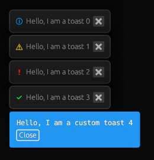

# egui-toast

[](https://crates.io/crates/egui-toast)
[](https://docs.rs/egui-toast)


Toast notifications for the [egui](https://github.com/emilk/egui) library.

[Try it out in a web demo](https://urholaukkarinen.github.io/egui-toast/)



## Quick start

```shell
cargo run -p egui-toast-demo
# or in wasm
cd demo && trunk serve
```


```rust
let mut toasts = Toasts::new()
    .anchor(Align2::RIGHT_BOTTOM, (-10.0, -10.0)) // 10 units from the bottom right corner
    .direction(egui::Direction::BottomUp);

if ui.button("Add toast").clicked() {
    toasts.add(Toast {
        text: "Hello, World!".into(),
        kind: ToastKind::Error,
        options: ToastOptions::default()
            .duration_in_seconds(5.0)
            .show_progress(true)
    });
}

// Show and update all toasts
toasts.show(ctx);
```

## Customization

Look of the notifications can be fully customized.

```rust
const MY_CUSTOM_TOAST: u32 = 0;

fn my_custom_toast_contents(ui: &mut Ui, toast: &mut Toast) -> Response {
    egui::Frame::default()
        .fill(Color32::from_rgb(33, 150, 243))
        .inner_margin(Margin::same(12.0))
        .rounding(4.0)
        .show(ui, |ui| {
            ui.label(toast.text.clone().color(Color32::WHITE));

            if ui.button("Close me").clicked() {
                toast.close();
            }
        }).response
}

let mut toasts = Toasts::new()
    .custom_contents(MY_CUSTOM_TOAST, my_custom_toast_contents);

if ui.button("Add toast").clicked() {
    toasts.add(Toast {
        text: "Hello, World!".into(),
        kind: ToastKind::Custom(MY_CUSTOM_TOAST),
        options: ToastOptions::default()
    });
}

toasts.show(ctx);
```
